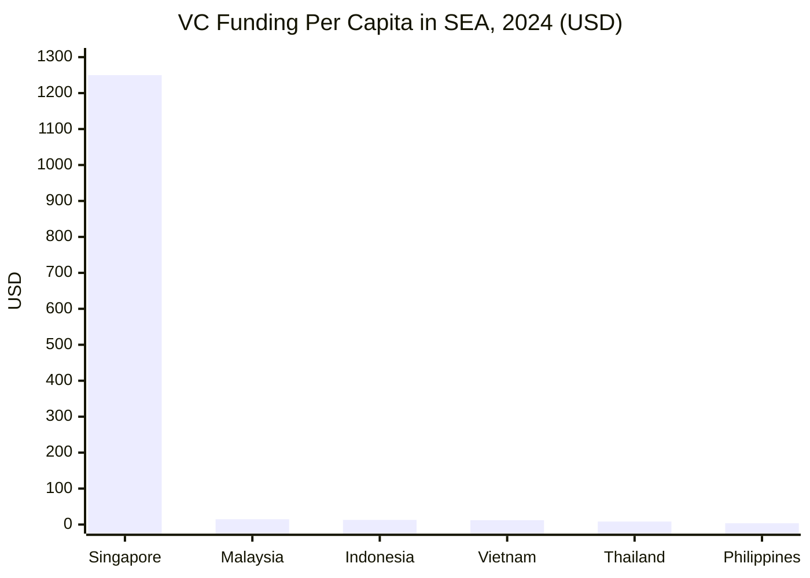
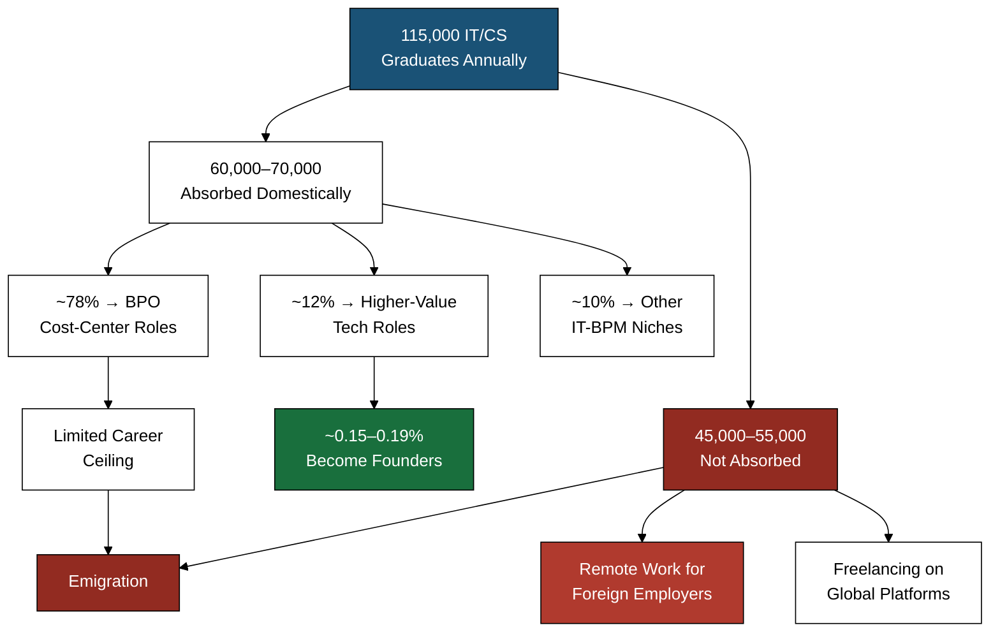

---

> *How to convert a country of BPO employees into builders and founders?* --Dominic Ligot

I consider Dr. Dominic Ligot one of my influences in tech. While this inquiry was from a few weeks ago, it stuck with me, and eventually compelled me to write. What I have come to realize is that much like the Greek Sisyphus is rolling a boulder perpetually in Tartarus, the demographic of aspiring founders in our country faces an uphill battle of bureaucracy and compounding forces that leaves them either to be content as workers, or take on the grueling task of navigating success. 

Because why is it that the Filipino people have been condensed to a phrase of: a country of BPO employees? Ladies and gentlemen, one should not classify this as an insult nor brush it off as fiction. One ought to take it constructively--and constructively, we must navigate the question and dissect the truth.

This inquiry allows us to surface the gap between a generation of Filipino technologists raised on outsourcing payrolls, who are optimized for service delivery ,and one capable of building equity-generating enterprises. The Philippines employs 1.9 million workers in the IT-Business Process Management sector alone, with a national economy that earns over $40 billion anually from exporting labor-as-a-service.

The question Dr. Ligot poses suggests that converting this population is desirable, feasible, or even directionally aligned with how the country's economic architecture currently functions.  I hope you will permit me to separate my optimism from the current realism of the system.

What started off as a short article designed to address the question and share my take on it has led me to a rabbithole of data, regulatory filings, labor statistics, venture capital records, and emigration rolls that presents a predictable yet compelling narrative. Reading the relevat literature has allowed me to pose another question--perhaps a supplement to the initial question:

> *"How to convert a country of BPO employees into builders and founders?*
> 
> *"Is the conversion economically rational for any individual participant?"*
## The Philippine Tech Workforce

The Philippine IT-BPM sector employed approximately 1.82 million full-time equivalents in 2024, generating $38.9 billion in revenue — roughly 8.5% of GDP. The IT and Business Process Association of the Philippines has targeted 2.5 million workers and $59 billion in revenue by 2028 under its Accelerate PH roadmap. The Commission on Higher Education reported approximately 115,000 IT and computer science graduates annually as of academic year 2024–2025, feeding a workforce with a median age of 28 years, 68% of whom hold at least a bachelor's degree in a computing or engineering discipline. Women constitute 46–48% of the broader IT-BPM workforce. However, that figure drops to approximately 22% in pure software engineering roles. The Philippine Software Industry Association estimated approximately 216,000 software developers operating domestically as of late 2025, with full-stack development and data engineering showing the steepest demand growth.

Of that 1.82 million, approximately 78% are employed in BPO and outsourcing operations — voice, non-voice, back-office processing — where the Filipino worker functions as a cost-center input for foreign firms. Only 12% of the IT-BPM workforce is classified under "higher-value" segments: software product development, animation, game development, and proprietary IT services. The remaining 10% occupy niche categories including healthcare information management. The BPO sector added 80,000 to 100,000 new jobs in 2024 alone, and IBPAP's Digital Cities 2025 initiative expanded operations into more than 25 provincial locations beyond Metro Manila. The industry's revenue CAGR from 2020 to 2024 held at 7.2%. But one must make the distinction between the expansion metrics of a services export machine and an innovation machine. And the metrics are unfortunately not that of an innovation machine.  

The Department of Trade and Industry had approximately 1,200 startups registered under the Philippine Startup Development Act (RA 11337) as of the first quarter of 2026, though only roughly 380 maintained active operations with at least one employee beyond the founding team. The QBO Innovation Hub's ecosystem report estimated between 2,800 and 3,500 individuals self-identifying as tech startup founders, the majority operating pre-revenue micro-enterprises. With 216,000 domestic software developers as the denominator, founders represent approximately 1.2–1.6% of the developer workforce. Against the broader IT-BPM population of 1.82 million, founders constitute 0.15–0.19%—which, for practical purposes, is an unfortunate statistical background music.

The individual Filipino technologist, however, is not the problem. The Philippines ranked 2nd in Asia and 22nd globally on the EF English Proficiency Index 2025, scoring 578 in the "High Proficiency" band. Filipino developers placed in the top 25% for technology skills on Coursera's recent Global Skills Report, with particular strength in data analysis, cloud computing, and software engineering. GitHub's Octoverse 2024 report logged a 38% year-over-year increase in active Filipino contributors — one of the fastest growth rates in Southeast Asia. An estimated 1.5 million Filipino freelancers were active on global platforms as of 2025, with 35% in tech-related categories, ranking the country 6th globally in the Payoneer freelancer index. The workforce is young--with a median national age of 25.7 years, English-fluent, technically literate, and cost-competitive at $10,000-$20,000 per year for mid-level developers—one-fifth to one-eighth the cost of equivalent talent in Singapore, the United States, or Australia. The local talent is real and tangible, that Filipinos are globally competitive. 

What does remain in the realm of fiction however is the economic and institutional structure that consistently converts that material into founders rather than employees.

## The Philippine Startup Ecosystem

The Philippine startup ecosystem, by the numbers available through Q1 of 2026, describes an infrastructure operating at a fraction of regional capacity. Total disclosed venture capital funding in Philippine startups was approximately $420–450 million in 2024, across 80 to 90 deals, a contraction from the $1.1 billion peak recorded in 2021. Q1 2025 produced approximately $85 million in disclosed transactions, projecting a full-year run rate of $340–380 million — a continued decline. The country has three unicorns — Mynt (GCash, valued at approximately $5 billion), Maya (formerly PayMaya, approximately $2 billion), and Voyager Innovations — all fintech, all incubated by major conglomerates (Globe/Ayala and PLDT/MVP Group respectively), none originating from the independent startup pipeline. Approximately 70% of registered startups fail before or shortly after launch, and the five-year survival rate for formally registered ventures sits at 10–15%. The pre-launch failure rate of 70% significantly exceeds the global average of 40–50%, indicating that the barriers to entry are the primary filter, not the barriers to scaling.

The comparison against Southeast Asian neighbors exposes the deficit in the structure. The Philippines receives the lowest venture capital funding per capita among major SEA economies: $3.68 per person in 2024, compared to $12.86 in Indonesia, $12.00 in Vietnam, $14.71 in Malaysia, and $1,250 in Singapore. Philippine GDP per capita stands at approximately $3,950, the lowest among the comparison set except for certain frontier markets. The country's digital economy was estimated at $28–35 billion in 2025 by the Google-Temasek-Bain e-Conomy SEA report, representing 6–7.5% of GDP. Indonesia's digital economy reached $110 billion in the same period; Vietnam and Thailand each registered approximately $36 billion. The World Bank's B-READY assessment placed the Philippines in the lower half of SEA economies for business environment quality, with particular weakness in construction permits, tax compliance, and the mechanics of starting a business. Internet penetration reached 78% and average fixed broadband speeds hit approximately 100 Mbps, improved but still trailing Thailand (220 Mbps), Malaysia (120 Mbps), and Singapore (300 Mbps).

| Metric                         | Philippines | Singapore | Indonesia | Vietnam   | Thailand  | Malaysia  |
| ------------------------------ | ----------- | --------- | --------- | --------- | --------- | --------- |
| GDP per capita (2025, USD)     | ~$3,950     | ~$87,000  | ~$5,200   | ~$4,650   | ~$7,800   | ~$14,100  |
| VC funding, 2024 (USD)         | ~$430M      | ~$7.5B    | ~$3.6B    | ~$1.2B    | ~$0.6B    | ~$0.5B    |
| Unicorns (2026)                | 3           | 25+       | 12        | 2–3       | 2         | 2         |
| Dev salary, mid-level (USD/yr) | $10.5K–$20K | $53K–$89K | $10K–$20K | $12K–$22K | $15K–$28K | $18K–$30K |
| Internet penetration           | ~78%        | ~98%      | ~73%      | ~79%      | ~90%      | ~97%      |
| Broadband speed (Mbps)         | ~100        | ~300      | ~35       | ~110      | ~220      | ~120      |
| Cost of living index           | ~34         | ~85       | ~35       | ~33       | ~40       | ~38       |

These figures yields a landscape where plausibility and friction coexist without proper resolution. A mid-level Filipino developer earns $10,000–$20,000 annually in a city with a cost of living index of 34, translating to approximately $441 of purchasing power per cost-of-living unit — roughly 54% of what a Singaporean developer commands at $823 per unit. Metro Manila ranked 136th of 173 cities in Mercer's Quality of Living Survey 2024, the lowest among major SEA capitals. Average one-way commute time: 96 minutes. Even with a conservative estimate from 2025, Commercial electricity at ₱11–12.50 per kilowatt-hour makes the Philippines one of the most expensive power markets in Asia — two to three times the rate in Vietnam, Indonesia, or Malaysia. That figure is bound to increase as we progress through 2026. The Philippine labor code mandates five days of paid service incentive leave annually after one year of service, compared to 7–14 in Singapore, 6–18 in Thailand, and 12 in Vietnam. The market exists. It is addressable, technically speaking. It is also, by every quality-of-life and cost-efficiency metric available, a harder place to build than almost anywhere else in the region.

## The National Brain Drain Issue

Last year, the Philippine Statistics Authority recorded approximately 1.96 million Overseas Filipino Workers deployed annually, with total stock estimates of overseas Filipinos at 10.2 million. That is 8.7% of the national population of 117 million. Within technology specifically, the Philippine Software Industry Association estimated that 40–45% of Filipino software developers with five or more years of experience have either relocated abroad or work remotely for foreign employers. A 2024 JobStreet Philippines survey found 72% of Filipino IT professionals expressing intent to work abroad within two to three years. The frequently cited estimate which is attributed to, Kumu co-founder Roland Ros, that approximately 80% of Filipino computer science professionals eventually work for foreign entities is corroborated by the convergence of CHED graduation data and domestic absorption figures: with 115,000 IT/CS graduates produced annually and domestic industry absorbing only 60,000–70,000, the residual 40–48% enter freelancing for foreign clients, BPO service roles, or emigration pipelines from day one.

The nature of this outflow is deliberate. Presidential Decree No. 442, which is the Labor Code of 1974, institutionalized labor export under the Marcos Sr. administration as a temporary unemployment measure and foreign exchange generator. The Philippine Overseas Employment Administration which was established in 1982 formalized government-managed labor deployment as a permanent national strategy, developing bilateral agreements with more than 40 countries. This decision meant that by the 1990s, overseas work had transitioned from economic necessity to cultural aspiration embedded across socioeconomic strata. That meant that what was once a necessity for financial and economic survival has transitioned to an economic dream for the average Filipino.

OFW remittances reached a record $37.2 billion in 2024, representing 8.5–9% of GDP. For Q1 2025, remittances totaled $9.65 billion, tracking a 3.1% year-over-year increase. The Philippines is the 4th largest remittance recipient globally, behind India, Mexico, and China. Remittances have exceeded foreign direct investment inflows every year for the past two decades. in 2024, FDI registered approximately $9.2 billion. That equates to roughly one quarter of remittance volume. The BPO industry itself was constructed on the same extractive logic: foreign firms accessing Filipino labor at lower cost, with intellectual property, equity, and strategic value accruing overseas. The Philippines has entrenched itself the provider of labor. But the fruits of said labor are captured elsewhere.

One must understand that the drivers for brain drain are rooted in simple arithmetic rather than ideology or a lack of national pride. A mid-level software engineer in the Philippines earns ₱600,000–₱1,200,000 per year ($10,000–$20,000). The equivalent role in Singapore pays SGD 72,000–120,000 ($53,000–$89,000); in the United States, $100,000–$160,000; in Australia, AUD 90,000–140,000 ($58,000–$91,000). Even adjusting for purchasing power parity, the domestic salary buys less: Metro Manila's quality-of-living ranking which is 136th of 173, 96-minute average commutes, PM2.5 levels of 25–30 µg/m³ against a WHO guideline of 5 µg/m³, and commercial power costs two to three times regional average collectively degrade the real value of a domestic peso. Career ceilings compress the timeline further — the domestic tech market rarely offers roles above Senior Developer or Team Lead.Most available work involves maintaining legacy systems or staff augmentation for foreign clients. Senior engineering titles (Staff Engineer, Principal Engineer, VP of Engineering) are structurally absent from most Philippine companies. All these factors combined means the incentive gradient points outward at every elevation.

Last year's Asian Development Bank projected in its Asian Development Outlook that Philippine skilled labor emigration will increase by 15–20% over the 2026–2030 period, accelerated by aging populations in destination countries and liberalized immigration pathways — Japan's Digital Nomad Visa, Australia's Global Talent Visa, Canada's Express Entry STEM stream. Remote work constitutes an additional, less visible channel: the PSIA estimated 300,000–400,000 Filipino tech workers as of 2025 performing work for foreign employers while physically resident in the Philippines, their economic output, intellectual property, and tax revenue accruing to entities outside the country. The International Labour Organization warned that approximately 46% of BPO tasks in the Philippines face high risk of AI-driven automation within five to seven years, potentially displacing 700,000–900,000 workers by 2030 and accelerating emigration as displaced workers seek opportunities abroad. The Philippine Development Plan 2023–2028 targets a "knowledge economy" transition but allocates 0.3% of GDP to research and development, against 2.2% in Singapore and 1.0% in Malaysia. What we are seeing is a huge difference between stated ambition and allocated capital. It goes to show us how the Philippine government delivers excellent outputs for its policy language, while the structural commitment functions as an excellent ornament on a slideshow presentation. 
## The Realities of the Filipino Founder

Where does that leave a prospect Filipino founder? The first friction point is registration and multi-agency compliance. Full corporate setup in the Philippines which include SEC registration via eSPARC, BIR enrollment, barangay and mayor's permits, and employer registration costs between ₱40,000 and ₱100,000 (approximately $650–$1,650 at the current 2026 exchange rates). This figure excludes legal and accountancy fees that are practically required for any corporation with complexity. Likewise, the average time to register a new domestic firm was 53 days in 2025, down from 75 days in 2024. While this is a measurable improvement, a 53-day registration window represents dead capital deployment at a point when most founding teams have no revenue. In Singapore, ACRA registration is completed within hours for approximately SGD $300. While founders from different country can move with efficiency, the Filipino founder is bottlenecked by the time-to-market cost that erodes runway before operations can actually begin.

Access to early-stage capital operates within a structurally narrow funnel. The Philippine Stock Exchange's requirement of three consecutive profitable years for technology listings makes the public market challenging to navigate for growth-stage startups by definitional logic. The IPO market's headline figure reports approximately $584 million raised—was driven entirely by the Maynilad Water Services legacy infrastructure listing, not by any technology company. Private capital is predominantly conglomerate-controlled: Ayala, SM, JG Summit, and San Miguel constitute the primary domestic acquirer and strategic investor pool. Exit optionality therefore depends on alignment with a handful of decision-makers whose sector preferences and IRR requirements may not align onto early-stage product companies. The overall realization rate—exit value versus total venture funding deployed between 2020 and 2024—stands at approximately 10.8%, versus global benchmarks of 20–40% in comparable markets. M&A deal value fell 46.5% in 2025 year-on-year, with startup-specific transactions remaining muted through governance concerns.

Infrastructure imposes costs that compound across every operational dimension. Commercial electricity cost places the Philippines among the most expensive power markets in Asia, two to three times the rate in Vietnam ($0.08/kWh), Indonesia ($0.07–$0.10), or Malaysia ($0.08). Provincial areas average 15–20 unscheduled power outages annually. Internet reliability, despite headline improvements to approximately 100 Mbps average fixed broadband, remains inconsistent outside Metro Manila, and mobile speeds of 30–35 Mbps rank approximately 85th globally. The Philippines remains a heavily cash-dependent economy — approximately 46% of transactions were cash-based as of 2024. Moreover, B2B payment infrastructure is underdeveloped relative to Singapore or Indonesia.

The talent acquisition problem is circular. With 216,000 domestic software developers competing against BPO employers, large enterprises, and remote foreign employers capable of paying two to five times local rates, startups consistently cite hiring as their primary operational challenge. The PSIA reports that only 20–30% of the 115,000 annual IT graduates are considered "job-ready" without significant additional training. Legal services for startup-specific instruments such as SAFE notes, convertible notes, stock option plans, venture financing documentation, are concentrated in a handful of firms (ACCRALAW, SyCip Salazar among them), with seed-stage financing legal fees running ₱200,000–₱500,000 ($3,300–$8,500). The mentorship layer is selective: available mentors are predominantly academics, corporate executives, or BPO leaders, with a critical shortage of individuals who have successfully scaled and exited startups. The Philippines has approximately 30 DOST Technology Business Incubators, most university-affiliated with limited commercial relevance.

When you stack these friction points, these challenges, founding in the the Philippines is not necessarily impossible, as evidenced by 380 active startup attest. But the economic opportunity cost of founding has greater risks than returns for any individuals with the skills to do so. Every month spent navigating BIR compliance, recruiting against foreign salary competition, and absorbing electricity costs that triple those of neighboring markets is a month that could be spent earning $4,400–$7,400 monthly in Singapore with zero equity risk. While a plausibility, economic and bureaucratic forces remains the barrier.
## In Search of Opportunities

While correlation does not equate causation, one would grasp that the brain drain and the founder deficit concerns of the country are not separate phenomena. Rather, they are the same phenomenon observed from different angles: 
- The systematic export of the human capital required to build a domestic technology economy. Each Filipino engineer who emigrates represents approximately ₱2–3 million ($34,000–$50,000) in state education investment, through subsidized public university systems, for which the economic return is captured by the destination country. 
- The domestic software development industry remains undersized relative to population: the Philippines, at 117 million people, fields approximately 216,000 developers, while Vietnam, at 100 million, fields approximately 530,000 . Philippine startup ecosystem funding in 2024 totaled $430 million against Indonesia's $3.6 billion and Vietnam's $1.2 billion. The talent shortage has pushed domestic developer salaries up 12–15% annually in 2024–2025, creating a wage-price spiral that erodes startup cost structures without resolving the underlying supply deficit.

The macroeconomic damage operates through capital formation. The World Bank noted way back in 2024 that remittance-dependent economies face a structural trap. High remittances boost consumption and real estate prices but do not translate into productive investment or technology transfer. The Philippines' gross capital formation as a percentage of GDP was approximately 24% in 2024, lower than Vietnam (33%), Indonesia (32%), or Thailand (27%). While remittances sustain household spending. They do not build laboratories, venture funds, or product companies. Structurally, the $37.2 billion in annual remittances represents the return on exported labor — a dividend paid to families for the permanent loss of their most capable members to foreign labor markets. FDI, at $9.2 billion, amounts to roughly one-quarter of that figure, confirming that the Philippine economy imports less productive capital than it exports productive humans.

The financial calculus for an individual is crystal clear. A Filipino engineer who relocates to Singapore accumulates approximately $265,000–$445,000 over a five-year horizon and benefits from career progression, CPF savings, and a pathway to permanent residency. A Filipino founder operating domestically over the same period accumulates approximately $15,000–$50,000 in salary, plus equity of uncertain value, against a 70% or greater probability that the venture produces nothing. A remote worker for a US or EU employer earns $4,000–$8,000 monthly while remaining in the Philippines multiples above what a bootstrapped founder takes home without exposure to regulatory compliance costs, hiring friction, or infrastructure deficits. The expected value differential between founding domestically and working for a foreign entity, whether abroad or remotely, is in an order of magnitudes.

Now, tell me--does the rational response incite enthusiasm? I hope not. I wish to hope, to believe, but hope without contradicting numbers point to madness. Belief without caution is a tale of blind faith.

The individual Filipino technologist considering founding a company in the Philippines in 2026 faces a market that invests a measly $3.68 per capita in venture funding, imposes compliance costs consuming 15–25% of pre-revenue budgets, offers a median exit value one-thirtieth of the global average, and competes for talent against employers offering five to eight times domestic compensation. The ecosystem's three unicorns emerged from conglomerate incubation with luxuries unavailable to independent founders. The 70% pre-launch failure rate is not a feature of founder quality, the talent metrics would like to have a word otherwise. But rather, it is the effect of structural friction that converts founding from an investment into a subsidy paid by the founder to an economy that has not reciprocated. 

The question Ligot posed has an answer that not anyone wants to hear. But I shall provide my readers the liberty to figure out and decide the verdict. I have laid my thoughts and research bare. I wish not peddle in propaganda, but merely advocate for rationality. 

One must assume Sisyphus is happy. But one must also assume SIsyphus struggles. One must assume that at some point, Sisyphus has gone tired.

## References

Asian Development Bank. (2025). *Asian Development Outlook 2025*. ADB.

Bangko Sentral ng Pilipinas. (2024). *Overseas Filipinos' remittances data, FY 2024*. BSP.

Bangko Sentral ng Pilipinas. (2024). *Financial inclusion survey 2024*. BSP.

Commission on Filipinos Overseas. (2024). *Stock estimate of overseas Filipinos*. CFO.

Commission on Higher Education. (2025). *Higher education statistics, AY 2024–2025*. CHED.

DealStreetAsia. (2024). *Southeast Asia funding annual review 2024*. DealStreetAsia.

Department of Science and Technology. (2025). *Technology business incubator directory*. DOST.

Department of Trade and Industry. (2025). *Ease of doing business reports 2025*. DTI.

Department of Trade and Industry. (2026). *Startup Development Act (RA 11337) registry data, Q1 2026*. DTI.

EF Education First. (2025). *EF English Proficiency Index 2025*. https://www.ef.com/epi/

GitHub. (2024). *The state of the Octoverse 2024*. GitHub.

Glassdoor. (2025). *Philippine developer salary data 2025*. Glassdoor.

Google, Temasek, & Bain & Company. (2025). *e-Conomy SEA 2025*. Google.

IBPAP. (2024). *Annual report 2024: Accelerate PH roadmap update*. IBPAP.

IMF. (2025). *World Economic Outlook, April 2025*. International Monetary Fund.

INSEAD & QBO Innovation Hub. (2024). *Philippine startup conversion rate analysis*. INSEAD.

International Labour Organization. (2025). *Future of work in the Philippines: AI and automation risk assessment*. ILO.

JobStreet Philippines. (2024). *IT professionals career intent survey 2024*. JobStreet.

Meralco. (2025). *Commercial rate schedules, Q1 2025*. Meralco/ERC.

Mercer. (2024). *Quality of Living Survey 2024*. Mercer.

National Economic and Development Authority. (2023). *Philippine Development Plan 2023–2028*. NEDA.

Numbeo. (2025). *Cost of Living Index 2025; Quality of Life Index 2025; Healthcare Index 2025*. Numbeo.

Ookla. (2025). *Speedtest Global Index, Q1 2025*. Ookla.

Payoneer. (2025). *Global freelancer income report 2025*. Payoneer.

PayScale. (2025). *Software engineer salary data: Philippines, Singapore, United States, Australia*. PayScale.

Philippine Institute for Development Studies. (2024). *Economic cost of brain drain: A productivity analysis* (Discussion Paper 2024-12). PIDS.

Philippine Software Industry Association. (2025). *Industry survey 2025*. PSIA.

Philippine Statistics Authority. (2024). *National accounts 2024*. PSA.

Philippine Statistics Authority. (2025). *OFW survey 2025*. PSA.

PitchBook. (2024). *Global startup exit data 2024*. PitchBook.

QBO Innovation Hub. (2025). *Philippine startup ecosystem report 2025*. QBO.

TomTom. (2024). *Traffic Index 2024*. TomTom.

TopDev. (2025). *Vietnam IT market report 2025*. TopDev.

Tracxn. (2025). *Southeast Asia funding report 2024–2025; Philippines startup database*. Tracxn.

UNESCO Institute for Statistics. (2024). *R&D expenditure as percentage of GDP*. UNESCO.

World Bank. (2024). *Philippines economic update 2024; Migration and remittances factbook 2024; B-READY indicators*. World Bank.